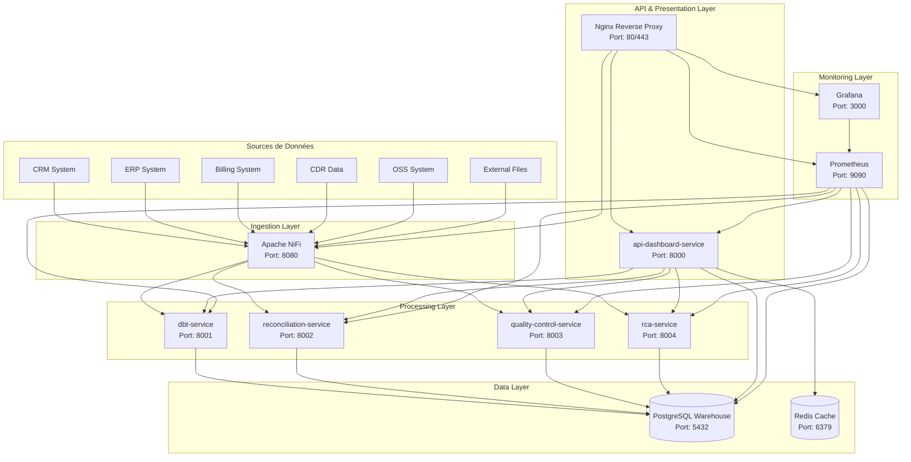
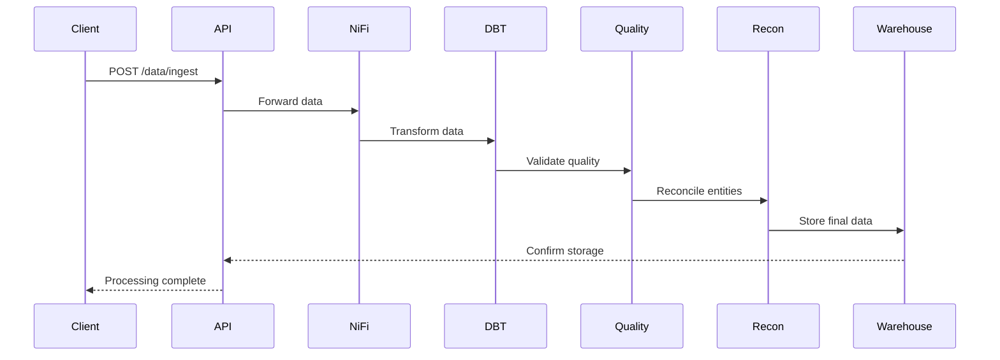
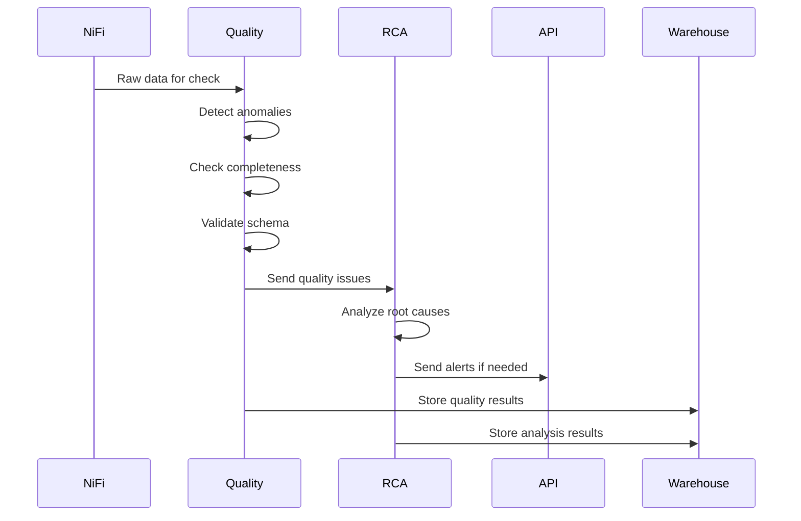
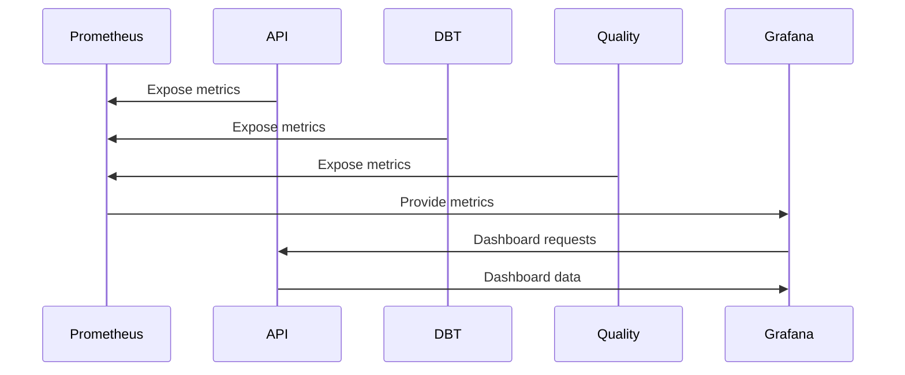

# 📋 Conception de la Plateforme SaaS Data

## 🎯 Vue d'ensemble

Cette plateforme SaaS offre une solution complète de traitement et d'analyse de données utilisant une architecture de microservices conteneurisés. Elle intègre l'ingestion, la transformation, la réconciliation, le contrôle qualité, l'analyse des causes racines et la visualisation des données.

## 🏗️ Architecture Générale

### Principe de Conception
- **Architecture Microservices** : Chaque service a une responsabilité unique et bien définie
- **Conteneurisation Docker** : Isolation et déploiement simplifié
- **Communication asynchrone** : Via HTTP REST et message queues
- **Stockage centralisé** : PostgreSQL comme data warehouse principal
- **Monitoring intégré** : Prometheus + Grafana pour l'observabilité

### Diagramme de Flux Global



## 🔧 Description Détaillée des Services

### 1. **nifi-service** - Service d'Ingestion (Port 8080)

**Rôle** : Point d'entrée principal pour l'ingestion de données depuis toutes les sources externes.

**Technologies** :
- Apache NiFi 1.23+
- Java 11+
- FlowFile Repository

**Fonctionnalités Principales** :
- **Ingestion Multi-Sources** : CRM, ERP, Billing, CDR, OSS, fichiers externes
- **Routage Intelligent** : Distribution des données vers les services appropriés
- **Gestion des Flux** : Orchestration des pipelines de données
- **Monitoring** : Suivi des performances et du débit
- **Retry Logic** : Gestion des échecs et reprises automatiques

**Endpoints Principaux** :
- `/nifi/` : Interface web NiFi
- `/api/flow/process-groups` : API de gestion des flux

**Interactions** :
- **Réception** : Données depuis sources externes (CRM, ERP, etc.)
- **Envoi vers** : Tous les services de traitement (DBT, Quality, Recon, RCA)
- **Stockage temporaire** : FlowFile Repository pour les données en transit

**Volumes** :
- `nifi-data` : Données en cours de traitement
- `nifi-conf` : Configuration des flux
- `nifi-logs` : Logs d'exécution

### 2. **dbt-service** - Service de Transformation (Port 8001)

**Rôle** : Transformation, normalisation et calcul de KPI des données.

**Technologies** :
- FastAPI
- dbt-core
- pandas, numpy
- PostgreSQL

**Fonctionnalités Principales** :
- **Transformation de Données** : Normalisation, agrégation, calculs
- **Calcul de KPI** : Métriques business en temps réel
- **Historique des Transformations** : Traçabilité complète
- **Validation** : Vérification de la cohérence des transformations

**Endpoints Principaux** :
- `POST /transform` : Transformation de données
- `POST /kpi/calculate` : Calcul de KPI
- `POST /normalize` : Normalisation selon règles
- `GET /transformations` : Historique des transformations

**Modèles de Données** :
```python
class TransformationRequest(BaseModel):
    data: List[Dict[str, Any]]
    transformation_type: str
    parameters: Dict[str, Any]
    calculate_kpis: bool = False
    kpi_metrics: List[str] = []

class TransformationResponse(BaseModel):
    transformation_id: str
    status: str
    transformed_data: List[Dict[str, Any]]
    metrics: Dict[str, Any]
    kpi_results: Optional[Dict[str, Any]]
    execution_time: float
```

**Interactions** :
- **Réception** : Données depuis NiFi
- **Envoi vers** : Warehouse-service (stockage), Quality-service (validation)
- **Stockage** : Résultats dans PostgreSQL

### 3. **reconciliation-service** - Service de Réconciliation (Port 8002)

**Rôle** : Résolution d'identité et consolidation des données avec Zingg.

**Technologies** :
- FastAPI
- Zingg (Python API)
- scikit-learn
- fuzzywuzzy

**Fonctionnalités Principales** :
- **Matching d'Entités** : Identification des doublons et similitudes
- **Déduplication Intelligente** : Fusion des enregistrements dupliqués
- **Scores de Confiance** : Évaluation de la qualité des matches
- **Fusion de Données** : Consolidation des informations

**Endpoints Principaux** :
- `POST /reconcile` : Réconciliation de données
- `POST /match` : Matching d'entités
- `POST /deduplicate` : Déduplication
- `POST /validate-matches` : Validation des matches

**Modèles de Données** :
```python
class ReconciliationRequest(BaseModel):
    data: List[Dict[str, Any]]
    matching_rules: Dict[str, Any]
    confidence_threshold: float = 0.8
    merge_strategy: str = "priority_based"

class ReconciliationResponse(BaseModel):
    reconciliation_id: str
    total_records: int
    matches_found: int
    duplicates_removed: int
    confidence_scores: List[float]
    merged_records: List[Dict[str, Any]]
    execution_time: float
```

**Interactions** :
- **Réception** : Données depuis NiFi ou DBT-service
- **Envoi vers** : Warehouse-service (stockage), Quality-service (validation)
- **Stockage** : Modèles Zingg et résultats dans PostgreSQL

### 4. **quality-control-service** - Service de Contrôle Qualité (Port 8003)

**Rôle** : Détection d'anomalies, validation et contrôle qualité avec Soda.

**Technologies** :
- FastAPI
- Soda SQL
- scikit-learn
- pandas

**Fonctionnalités Principales** :
- **Détection d'Anomalies** : Isolation Forest, One-Class SVM
- **Validation de Schéma** : Vérification de la structure des données
- **Contrôle de Complétude** : Détection des valeurs manquantes
- **Vérification de Cohérence** : Validation des règles métier
- **Rapports de Qualité** : Génération de rapports détaillés

**Endpoints Principaux** :
- `POST /check` : Contrôle qualité complet
- `POST /detect-anomalies` : Détection d'anomalies
- `POST /validate-schema` : Validation de schéma
- `POST /check-completeness` : Vérification complétude
- `POST /generate-report` : Génération de rapports

**Modèles de Données** :
```python
class QualityCheckRequest(BaseModel):
    data: List[Dict[str, Any]]
    quality_rules: List[Dict[str, Any]]
    data_source: str = "unknown"
    check_anomalies: bool = True
    check_duplicates: bool = True
    check_completeness: bool = True
    check_consistency: bool = True
    check_validity: bool = True

class QualityCheckResponse(BaseModel):
    check_id: str
    status: str
    total_records: int
    quality_score: float
    issues_found: List[Dict[str, Any]]
    anomalies: List[Dict[str, Any]]
    duplicates: List[Dict[str, Any]]
    recommendations: List[str]
    execution_time: float
```

**Interactions** :
- **Réception** : Données depuis NiFi, DBT-service, ou Reconciliation-service
- **Envoi vers** : Warehouse-service (stockage), RCA-service (analyse)
- **Stockage** : Résultats de qualité et rapports dans PostgreSQL

### 5. **rca-service** - Service d'Analyse des Causes Racines (Port 8004)

**Rôle** : Analyse des causes racines et corrélations dans les données.

**Technologies** :
- FastAPI
- scikit-learn
- networkx
- pandas

**Fonctionnalités Principales** :
- **Analyse de Corrélation** : Identification des relations entre variables
- **Détection de Tendances** : Analyse temporelle des patterns
- **Identification des Causes Racines** : Algorithmes de causalité
- **Recommandations** : Suggestions d'actions correctives
- **Prédiction d'Échecs** : Modèles prédictifs

**Endpoints Principaux** :
- `POST /analyze` : Analyse RCA complète
- `POST /correlation` : Analyse de corrélation
- `POST /trend-analysis` : Analyse de tendances
- `POST /predict-failure` : Prédiction d'échecs

**Modèles de Données** :
```python
class RCAAnalysisRequest(BaseModel):
    data: List[Dict[str, Any]]
    analysis_type: str = "comprehensive"
    time_window: str = "30d"
    target_metric: str
    correlation_threshold: float = 0.7

class RCAAnalysisResponse(BaseModel):
    analysis_id: str
    root_causes: List[Dict[str, Any]]
    correlations: List[Dict[str, Any]]
    trends: List[Dict[str, Any]]
    predictions: List[Dict[str, Any]]
    recommendations: List[str]
    confidence_score: float
    execution_time: float
```

**Interactions** :
- **Réception** : Données depuis Quality-service ou directement depuis le warehouse
- **Envoi vers** : Warehouse-service (stockage), API-dashboard (alertes)
- **Stockage** : Résultats d'analyse dans PostgreSQL

### 6. **api-dashboard-service** - Service API et Dashboard (Port 8000)

**Rôle** : API principale et interface de visualisation pour la plateforme.

**Technologies** :
- FastAPI
- Streamlit
- Plotly
- Jinja2 Templates

**Fonctionnalités Principales** :
- **API REST Complète** : Endpoints pour tous les services
- **Dashboard Interactif** : Visualisation des données et métriques
- **Gestion des Utilisateurs** : Authentification et autorisation
- **Monitoring des Services** : État de santé en temps réel
- **Génération de Rapports** : Rapports personnalisés
- **Gestion des Alertes** : Configuration et notification

**Endpoints Principaux** :
- `GET /` : Dashboard principal
- `GET /health` : État de santé du système
- `POST /data/ingest` : Ingestion de données
- `GET /kpis` : Récupération des KPI
- `GET /dashboard/data` : Données du dashboard
- `POST /alerts/configure` : Configuration des alertes

**Modèles de Données** :
```python
class HealthResponse(BaseModel):
    status: str
    timestamp: datetime
    services: Dict[str, str]
    uptime: float

class ServiceStatus(BaseModel):
    name: str
    status: str
    response_time: float
    last_check: datetime
```

**Interactions** :
- **Orchestration** : Coordonne tous les autres services
- **Réception** : Requêtes utilisateur et données des services
- **Envoi vers** : Tous les services de traitement
- **Stockage** : Cache Redis, données dans PostgreSQL

### 7. **warehouse-service** - Service de Stockage (Port 5432)

**Rôle** : Data warehouse central pour le stockage historique et l'audit.

**Technologies** :
- PostgreSQL 15+
- pgAdmin (optionnel)
- Extensions : PostGIS, pg_stat_statements

**Fonctionnalités Principales** :
- **Stockage Historique** : Toutes les données transformées
- **Audit Trail** : Traçabilité complète des opérations
- **Métriques Système** : Performance et utilisation
- **Logs d'Audit** : Journalisation des accès et modifications
- **Sauvegardes** : Backup automatique et restauration

**Structure de Base de Données** :
```sql
-- Tables principales
CREATE TABLE data_sources (
    id SERIAL PRIMARY KEY,
    name VARCHAR(255) NOT NULL,
    type VARCHAR(100) NOT NULL,
    configuration JSONB,
    created_at TIMESTAMP DEFAULT NOW()
);

CREATE TABLE transformations (
    id UUID PRIMARY KEY,
    service_name VARCHAR(100) NOT NULL,
    transformation_type VARCHAR(100) NOT NULL,
    input_data JSONB,
    output_data JSONB,
    metrics JSONB,
    execution_time FLOAT,
    created_at TIMESTAMP DEFAULT NOW()
);

CREATE TABLE quality_checks (
    id UUID PRIMARY KEY,
    check_type VARCHAR(100) NOT NULL,
    data_source VARCHAR(255),
    quality_score FLOAT,
    issues_found JSONB,
    recommendations JSONB,
    created_at TIMESTAMP DEFAULT NOW()
);

CREATE TABLE reconciliation_results (
    id UUID PRIMARY KEY,
    total_records INTEGER,
    matches_found INTEGER,
    duplicates_removed INTEGER,
    confidence_scores JSONB,
    created_at TIMESTAMP DEFAULT NOW()
);

CREATE TABLE rca_analyses (
    id UUID PRIMARY KEY,
    analysis_type VARCHAR(100) NOT NULL,
    root_causes JSONB,
    correlations JSONB,
    trends JSONB,
    recommendations JSONB,
    confidence_score FLOAT,
    created_at TIMESTAMP DEFAULT NOW()
);
```

**Interactions** :
- **Réception** : Données de tous les services de traitement
- **Fourniture** : Données pour l'API-dashboard et les analyses
- **Stockage** : Persistance de toutes les données et métadonnées

## 🔄 Flux d'Interactions Entre Services

### 1. **Flux d'Ingestion Standard**



### 2. **Flux de Contrôle Qualité**



### 3. **Flux de Monitoring**



## 📊 Patterns d'Architecture

### 1. **Event-Driven Architecture**
- **Events** : Données ingérées, transformations terminées, alertes générées
- **Producers** : NiFi, services de traitement
- **Consumers** : API-dashboard, monitoring, alerting

### 2. **CQRS (Command Query Responsibility Segregation)**
- **Commands** : Ingestion, transformation, réconciliation
- **Queries** : Dashboard, rapports, métriques
- **Separation** : Services spécialisés pour chaque responsabilité

### 3. **Saga Pattern**
- **Orchestration** : API-dashboard coordonne les transactions
- **Compensation** : Rollback en cas d'échec
- **Idempotency** : Opérations reproductibles

### 4. **Circuit Breaker Pattern**
- **Protection** : Isolation des services défaillants
- **Fallback** : Stratégies de contournement
- **Recovery** : Reprise automatique

## 🔒 Sécurité et Gouvernance

### 1. **Authentification et Autorisation**
- **JWT Tokens** : Authentification stateless
- **RBAC** : Rôles et permissions granulaires
- **API Keys** : Authentification service-to-service

### 2. **Chiffrement**
- **TLS/SSL** : Communication chiffrée entre services
- **Chiffrement au Repos** : Données sensibles chiffrées
- **Secrets Management** : Gestion sécurisée des clés

### 3. **Audit et Conformité**
- **Audit Trail** : Traçabilité complète des actions
- **Data Lineage** : Traçabilité des données
- **Retention Policies** : Politiques de conservation

## 📈 Scalabilité et Performance

### 1. **Scaling Horizontal**
- **Load Balancing** : Nginx pour la distribution de charge
- **Service Replication** : Multiple instances des services
- **Database Sharding** : Partitionnement des données

### 2. **Caching Strategy**
- **Redis Cache** : Cache applicatif et session
- **Query Result Cache** : Cache des résultats de requêtes
- **CDN** : Cache des assets statiques

### 3. **Performance Monitoring**
- **APM** : Application Performance Monitoring
- **Distributed Tracing** : Traçage des requêtes
- **Real-time Metrics** : Métriques en temps réel

## 🚀 Déploiement et DevOps

### 1. **Containerisation**
- **Docker** : Isolation et portabilité
- **Multi-stage Builds** : Images optimisées
- **Health Checks** : Vérification de santé

### 2. **Orchestration**
- **Docker Compose** : Orchestration locale
- **Kubernetes** : Orchestration production (optionnel)
- **Service Discovery** : Découverte automatique des services

### 3. **CI/CD Pipeline**
- **Automated Testing** : Tests unitaires et d'intégration
- **Code Quality** : Linting et analyse statique
- **Automated Deployment** : Déploiement automatique

## 📋 Métriques et KPIs

### 1. **Métriques Techniques**
- **Throughput** : Nombre de records traités par minute
- **Latency** : Temps de réponse des services
- **Error Rate** : Taux d'erreur par service
- **Resource Usage** : CPU, mémoire, stockage

### 2. **Métriques Business**
- **Data Quality Score** : Score de qualité global
- **Processing Efficiency** : Efficacité de traitement
- **User Satisfaction** : Satisfaction utilisateur
- **Cost per Transaction** : Coût par transaction

### 3. **Métriques de Sécurité**
- **Security Incidents** : Nombre d'incidents de sécurité
- **Access Violations** : Violations d'accès
- **Compliance Score** : Score de conformité
- **Audit Coverage** : Couverture d'audit

---

**Cette conception garantit une plateforme SaaS robuste, scalable et maintenable, capable de traiter de gros volumes de données tout en maintenant une haute qualité de service.**
