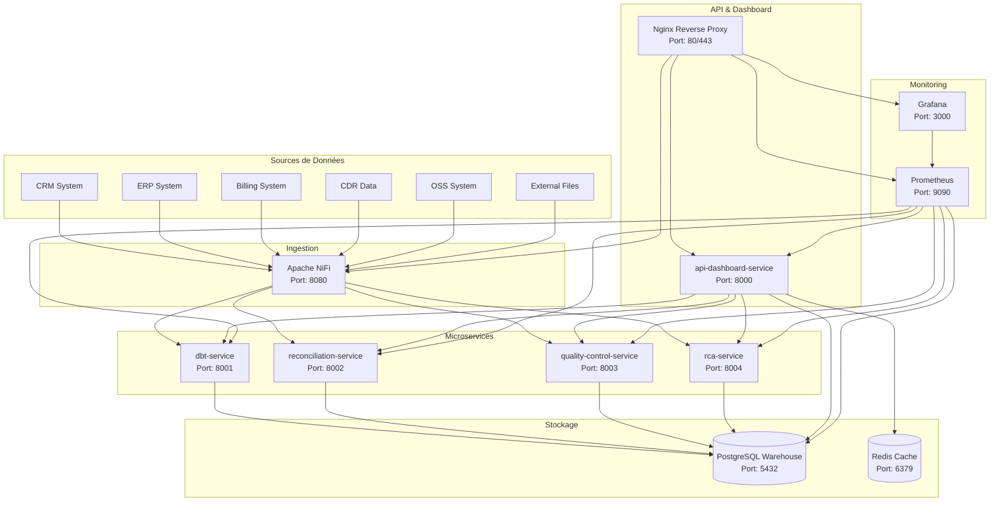
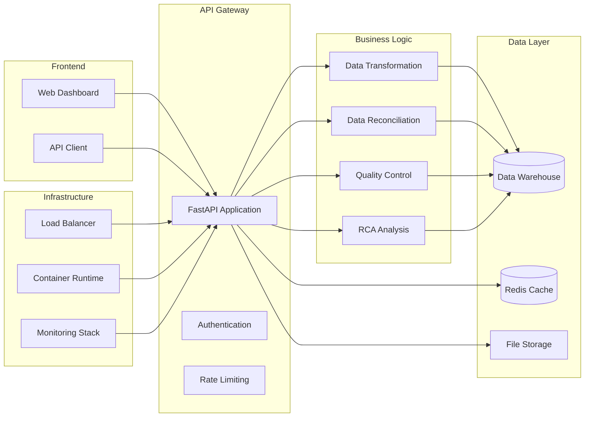
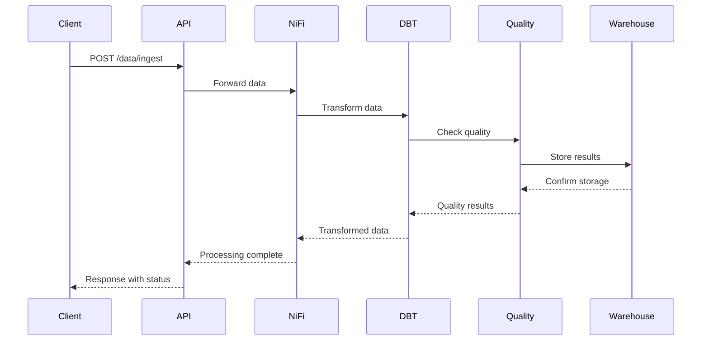

# 🚀 SaaS Data Platform - Plateforme de Données Conteneurisée

Une plateforme SaaS complète de traitement et d'analyse de données utilisant des microservices conteneurisés avec Docker, Apache NiFi pour l'ingestion, et des services spécialisés pour la transformation, réconciliation, contrôle qualité et analyse des causes racines.

## 📋 Table des Matières

- [Vue d'ensemble](#-vue-densemble)
- [Architecture](#-architecture)
- [Services](#-services)
- [Installation](#-installation)
- [Utilisation](#-utilisation)
- [API Documentation](#-api-documentation)
- [Monitoring](#-monitoring)
- [Tests](#-tests)
- [Déploiement](#-déploiement)
- [Contribuer](#-contribuer)

## 🎯 Vue d'ensemble

Cette plateforme SaaS offre une solution complète pour :

- **Ingestion de données** depuis multiples sources (CRM, ERP, Billing, CDR, OSS, fichiers externes)
- **Transformation et normalisation** des données avec dbt
- **Réconciliation et déduplication** avec Zingg
- **Contrôle qualité** avec Soda
- **Analyse des causes racines** (RCA)
- **Streaming de données** avec Apache Kafka (mode KRaft)
- **API REST et Dashboard** pour visualisation et monitoring
- **Stockage historique** avec PostgreSQL

## 🏗️ Architecture

### Diagramme de Flux Global



### Diagramme de Composants



### Diagramme de Séquence - Flux de Données



## 🔧 Services

### 1. **api-dashboard-service** (Port 8000)
- **Rôle** : API principale et dashboard web
- **Technologies** : FastAPI, Streamlit, Plotly
- **Fonctionnalités** :
  - API REST complète
  - Dashboard interactif
  - Gestion des utilisateurs et authentification
  - Monitoring des autres services
  - Génération de rapports

### 2. **nifi-service** (Port 8080)
- **Rôle** : Ingestion et routage des données
- **Technologies** : Apache NiFi
- **Fonctionnalités** :
  - Ingestion depuis multiples sources
  - Routage intelligent des données
  - Gestion des flux de données
  - Monitoring des performances

### 3. **dbt-service** (Port 8001)
- **Rôle** : Transformation et normalisation
- **Technologies** : dbt-core, pandas, numpy
- **Fonctionnalités** :
  - Transformation de données
  - Calcul de KPI
  - Normalisation des données
  - Historique des transformations

### 4. **reconciliation-service** (Port 8002)
- **Rôle** : Réconciliation et déduplication
- **Technologies** : Zingg, scikit-learn, fuzzywuzzy
- **Fonctionnalités** :
  - Matching d'entités
  - Déduplication intelligente
  - Fusion de données
  - Scores de confiance

### 5. **quality-control-service** (Port 8003)
- **Rôle** : Contrôle qualité et détection d'anomalies
- **Technologies** : Soda, scikit-learn, pandas
- **Fonctionnalités** :
  - Vérification de complétude
  - Validation des données
  - Détection d'anomalies
  - Rapports de qualité

### 6. **rca-service** (Port 8004)
- **Rôle** : Analyse des causes racines
- **Technologies** : scikit-learn, networkx, pandas
- **Fonctionnalités** :
  - Analyse de corrélation
  - Détection de tendances
  - Identification des causes racines
  - Recommandations

### 7. **warehouse-service** (Port 5432)
- **Rôle** : Stockage historique et audit
- **Technologies** : PostgreSQL
- **Fonctionnalités** :
  - Stockage des données transformées
  - Historique des opérations
  - Métriques système
  - Logs d'audit

### 8. **kafka** (Port 9092) - Mode KRaft
- **Rôle** : Streaming de données et messagerie
- **Technologies** : Apache Kafka 7.4.0 (mode KRaft)
- **Fonctionnalités** :
  - Streaming de données en temps réel
  - Messagerie asynchrone entre services
  - Topics pour événements CDR, alertes, métriques
  - Architecture simplifiée sans ZooKeeper

## 🚀 Installation

### Prérequis

- Docker 20.10+
- Docker Compose 2.0+
- 8 GB RAM minimum
- 20 GB espace disque libre

### Installation Rapide

```bash
# Cloner le projet
git clone <repository-url>
cd saas

# Construire et démarrer tous les services
docker-compose up --build

# Vérifier que tous les services sont démarrés
docker-compose ps
```

### Installation Détaillée

```bash
# 1. Construire les images Docker
docker-compose build

# 2. Démarrer la base de données et Redis
docker-compose up -d warehouse-service redis

# 3. Attendre que la base soit prête
docker-compose logs warehouse-service

# 4. Démarrer les microservices
docker-compose up -d dbt-service reconciliation-service quality-control-service rca-service

# 5. Démarrer NiFi et l'API Dashboard
docker-compose up -d nifi-service api-dashboard-service

# 6. Démarrer le monitoring
docker-compose up -d prometheus grafana

# 7. Démarrer le reverse proxy
docker-compose up -d nginx
```

### Variables d'Environnement

Créer un fichier `.env` à la racine :

```env
# Base de données
POSTGRES_DB=data_warehouse
POSTGRES_USER=warehouse_user
POSTGRES_PASSWORD=warehouse_password

# API Dashboard
SECRET_KEY=your-secret-key-here-change-in-production
DEBUG=false

# Monitoring
GRAFANA_ADMIN_PASSWORD=admin
PROMETHEUS_RETENTION=30d

# Redis
REDIS_PASSWORD=redis_password
```

## 📖 Utilisation

### Accès aux Services

| Service | URL | Description |
|---------|-----|-------------|
| Dashboard Principal | http://localhost | Interface web principale |
| API Documentation | http://localhost/docs | Documentation Swagger |
| NiFi | http://localhost/nifi | Interface NiFi |
| Grafana | http://localhost/grafana | Monitoring (admin/admin) |
| Prometheus | http://localhost/prometheus | Métriques |

### Utilisation de l'API

#### Ingestion de Données

```bash
# Ingestion via API
curl -X POST "http://localhost/data/ingest" \
  -H "Content-Type: application/json" \
  -d '[
    {
      "id": "1",
      "name": "John Doe",
      "email": "john@example.com",
      "value": 100.50
    }
  ]'
```

#### Transformation de Données

```bash
# Transformation via dbt-service
curl -X POST "http://localhost:8001/transform" \
  -H "Content-Type: application/json" \
  -d '{
    "data": [...],
    "transformation_type": "normalize",
    "parameters": {
      "normalize_numeric": true,
      "trim_strings": true
    }
  }'
```

#### Contrôle Qualité

```bash
# Contrôle qualité via quality-control-service
curl -X POST "http://localhost:8003/check" \
  -H "Content-Type: application/json" \
  -d '{
    "data": [...],
    "quality_rules": [
      {
        "type": "required_field",
        "field": "email"
      }
    ],
    "check_completeness": true,
    "check_validity": true
  }'
```

### Utilisation du Dashboard

1. **Accéder au dashboard** : http://localhost
2. **Voir l'état des services** : Widget "État des Services"
3. **Consulter les métriques** : Widget "Score de Qualité"
4. **Surveiller les alertes** : Section "Alertes"
5. **Générer des rapports** : Section "Rapports"

## 📚 API Documentation

### Endpoints Principaux

#### API Dashboard (Port 8000)

| Endpoint | Méthode | Description |
|----------|---------|-------------|
| `/health` | GET | État de santé du système |
| `/dashboard/data` | GET | Données du dashboard |
| `/data/ingest` | POST | Ingestion de données |
| `/kpis` | GET | KPI système |
| `/alerts/configure` | POST | Configuration d'alertes |
| `/metrics/overview` | GET | Vue d'ensemble des métriques |

#### Service DBT (Port 8001)

| Endpoint | Méthode | Description |
|----------|---------|-------------|
| `/health` | GET | État du service |
| `/transform` | POST | Transformation de données |
| `/kpi/calculate` | POST | Calcul de KPI |
| `/normalize` | POST | Normalisation |
| `/metrics` | GET | Métriques du service |

#### Service Réconciliation (Port 8002)

| Endpoint | Méthode | Description |
|----------|---------|-------------|
| `/health` | GET | État du service |
| `/reconcile` | POST | Réconciliation de données |
| `/match` | POST | Matching d'entités |
| `/deduplicate` | POST | Déduplication |
| `/validate-matches` | POST | Validation des matches |

#### Service Contrôle Qualité (Port 8003)

| Endpoint | Méthode | Description |
|----------|---------|-------------|
| `/health` | GET | État du service |
| `/check` | POST | Contrôle qualité |
| `/detect-anomalies` | POST | Détection d'anomalies |
| `/validate-schema` | POST | Validation de schéma |
| `/check-completeness` | POST | Vérification complétude |

#### Service RCA (Port 8004)

| Endpoint | Méthode | Description |
|----------|---------|-------------|
| `/health` | GET | État du service |
| `/analyze` | POST | Analyse RCA |
| `/correlation` | POST | Analyse de corrélation |
| `/trend-analysis` | POST | Analyse de tendances |
| `/predict-failure` | POST | Prédiction d'échecs |

## 📊 Monitoring

### Métriques Disponibles

- **Performance** : Temps de réponse, débit, utilisation CPU/Mémoire
- **Qualité** : Scores de qualité, taux d'erreur, complétude
- **Business** : KPI métier, volumes de données, alertes
- **Infrastructure** : État des services, connectivité, stockage
- **Kafka** : Débit des topics, latence, consommation, production

## 🔄 Kafka Streaming (Mode KRaft)

### Configuration

Kafka fonctionne en mode KRaft (sans ZooKeeper) pour une architecture simplifiée :

```bash
# Démarrer Kafka
make kafka-up

# Vérifier le statut
make kafka-test

# Initialiser les topics
make kafka-init-topics

# Lister les topics
make kafka-topics
```

### Topics Disponibles

| Topic | Description | Partitions |
|-------|-------------|------------|
| `cdr-events` | Événements CDR | 3 |
| `alerts` | Alertes système | 3 |
| `metrics` | Métriques de performance | 3 |
| `quality-events` | Événements de qualité | 3 |
| `reconciliation-events` | Événements de réconciliation | 3 |
| `rca-events` | Événements d'analyse RCA | 3 |
| `dbt-events` | Événements de transformation | 3 |
| `audit-logs` | Logs d'audit | 3 |

### Utilisation

```bash
# Produire un message
make kafka-produce TOPIC=test-topic MESSAGE="Hello Kafka"

# Consommer des messages
make kafka-consume TOPIC=test-topic

# Tester la connectivité
make kafka-test
```

### Scripts PowerShell (Windows)

```powershell
# Initialiser les topics
.\scripts\init-kafka-topics.ps1

# Tester Kafka
.\scripts\test-kafka-kraft.ps1
```

### Dashboards Grafana

1. **Dashboard Système** : Métriques d'infrastructure
2. **Dashboard Qualité** : Métriques de qualité des données
3. **Dashboard Performance** : Métriques de performance
4. **Dashboard Business** : KPI métier

### Alertes Configurables

- Score de qualité < seuil
- Taux d'erreur > seuil
- Service indisponible
- Délai de traitement > seuil
- Utilisation ressources > seuil

## 🧪 Tests

### Exécution des Tests

```bash
# Tests unitaires
pytest tests/unit/ -v

# Tests d'intégration
pytest tests/integration/ -v

# Tests avec couverture
pytest --cov=. --cov-report=html

# Tests spécifiques
pytest tests/unit/test_dbt_service.py::TestDataTransformationService -v
```

### Structure des Tests

```
tests/
├── conftest.py              # Configuration globale
├── requirements.txt         # Dépendances de test
├── unit/                   # Tests unitaires
│   └── test_dbt_service.py
└── integration/            # Tests d'intégration
    └── test_api_integration.py
```

### Couverture de Code

- **Objectif** : 80% minimum
- **Rapport HTML** : `htmlcov/index.html`
- **Rapport terminal** : Affiché après exécution

## 🚀 Déploiement

### Déploiement en Production

```bash
# 1. Configuration production
cp .env.production .env

# 2. Build optimisé
docker-compose -f docker-compose.prod.yml build

# 3. Déploiement
docker-compose -f docker-compose.prod.yml up -d

# 4. Vérification
docker-compose -f docker-compose.prod.yml ps
```

### Configuration Production

- SSL/TLS avec certificats
- Base de données externalisée
- Monitoring avancé
- Logs centralisés
- Sauvegardes automatiques

### Scaling Horizontal

```bash
# Scale des services
docker-compose up -d --scale dbt-service=3
docker-compose up -d --scale quality-control-service=2
```

## 🔧 Maintenance

### Sauvegardes

```bash
# Sauvegarde base de données
docker exec warehouse-service pg_dump -U warehouse_user data_warehouse > backup.sql

# Sauvegarde volumes
docker run --rm -v saas_postgres-data:/data -v $(pwd):/backup alpine tar czf /backup/postgres-backup.tar.gz /data
```

### Logs

```bash
# Logs en temps réel
docker-compose logs -f

# Logs d'un service spécifique
docker-compose logs -f api-dashboard-service

# Logs avec timestamps
docker-compose logs -f -t
```

### Mise à Jour

```bash
# Mise à jour des images
docker-compose pull
docker-compose up -d

# Rebuild complet
docker-compose down
docker-compose up --build -d
```

## 🤝 Contribuer

### Guidelines

1. Fork le projet
2. Créer une branche feature (`git checkout -b feature/AmazingFeature`)
3. Commit les changements (`git commit -m 'Add AmazingFeature'`)
4. Push vers la branche (`git push origin feature/AmazingFeature`)
5. Ouvrir une Pull Request

### Standards de Code

- **Python** : PEP 8, Black formatter
- **Tests** : Couverture 80% minimum
- **Documentation** : Docstrings et README
- **Commits** : Messages clairs et descriptifs

## 📄 Licence

Ce projet est sous licence MIT. Voir le fichier `LICENSE` pour plus de détails.

## 📞 Support

- **Issues** : [GitHub Issues](link-to-issues)
- **Documentation** : [Wiki](link-to-wiki)
- **Email** : support@saas-platform.com

## 🎯 Roadmap

### Version 2.0
- [ ] Support multi-tenant
- [ ] Machine Learning intégré
- [ ] Streaming en temps réel
- [ ] Interface mobile

### Version 2.1
- [ ] Intégration cloud native
- [ ] Auto-scaling intelligent
- [ ] Analytics avancés
- [ ] API GraphQL

---

**Développé avec ❤️ pour la communauté open source**
